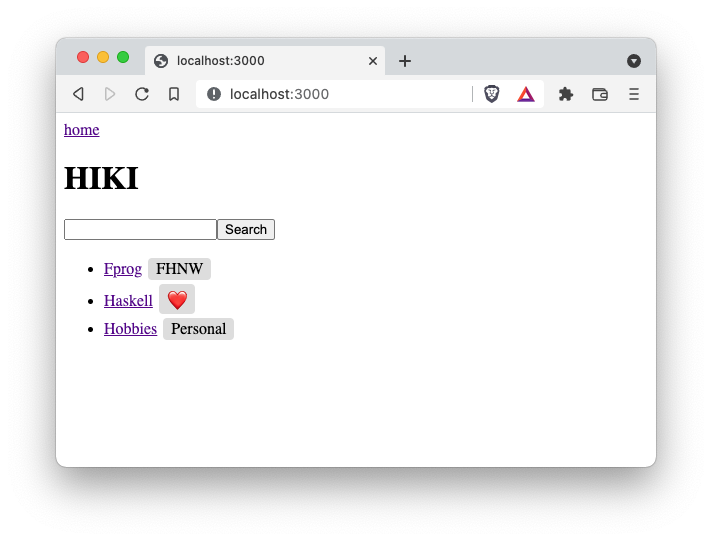
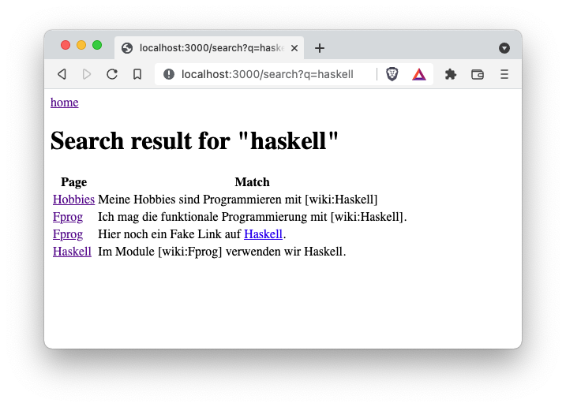

# fprog Programmierprojekt HS21

## Thema
In diesem Programmierprojekt implementieren Sie Ihr eigenes WIKI in Haskell.


<p>Abbildung 1: Startseite</p>


<p>Abbildung 2: Wikiseite anzeigen</p>


<p>Abbildung 3: Wikiseite editieren</p>


<p>Abbildung 4: Wikiseiten durchsuchen</p>


<p>Abbildung 5: Wikiseite löschen (hat Referenzen)</p>


<p>Abbildung 6: Wikiseite löschen (hat keine Referenzen)</p>


## Rahmenbedingung
- Dieses Projekt ist eine **Einzelarbeit**. Gemäss Prüfungsordnung resultiert ein Verstoss gegen diese Bedingung mit der **Note 1**.
- Das Projekt muss mit GHC 8.10.7 und Cabal 3.4.0.0 gebaut und gestartet werden können.
- Es dürfen keine zusätzlichen Libraries im `hiki.cabal` unter `build-depends` hinzugefügt werden.
- Fragen schicken Sie per Mail an `daniel.kroeni@fhnw.ch`. Ich werde dann die Frage und die Antwort auf MS Teams publizieren, damit alle dieselben Informationen haben.


## Spezifikation der Anwendung
Dieses [Video](https://tube.switch.ch/videos/XCQoj6gfR4) spezifiziert die Funktionalität der Applikation.

### HTTP Routen
- **Startseite:** GET http://localhost:3000/
- **Wikiseite anzeigen:** GET http://localhost:3000/pages/Fprog (Falls die Seite nicht existiert, wird auf /edit redirected.)
- **Wikiseite editieren:** GET http://localhost:3000/pages/Fprog/edit (Falls die Seite nicht existiert, wird ein default Inhalt im Textfeld dargestellt.)
- **Wikiseite speichern:** POST http://localhost:3000/pages/Fprog/edit (im Body unter dem `param "content"` wird der Seiteninhalt erwartet.)
- **Suche:** GET http://localhost:3000/search?q=Query 
- **Löschseite anzeigen:** GET http://localhost:3000/pages/Fprog/delete
- **Wikiseite löschen:** POST http://localhost:3000/pages/Fprog/delete


### Datenhaltung
Die Wikiseiten werden als Datei im [`data`](data/) Ordner abgelegt.
Aktuell sind da bereits drei Wikiseiten abgelegt.
Der Name einer Datei entspricht dem Namen der entsprechenden Wikiseite. Die Dateien haben also keine Dateiendung.
Sie können bei dieser Arbeit davon ausgehen, dass nur Namen verwendet werden, die kompatibel sind mit dem Dateisystem.

## Aufgabe
Implementieren Sie das Wiki. Ich schlage vor, dass Sie etwa in der Reihenfolge der funktionalen Kriterien vorgehen.


## **Bewertung**
In diesem Projekt sind 50 Punkte erreichbar. Bei einer linearen Skala entspricht ein Punkt einer Zehntelnote. 
Beispiel: 35 Punkte geben 1 + (35/10) = 4.5

Wichtig! Die Kriterien sind **Alles oder Nichts**. Halb erfüllte Kriterien geben 0 Punkte.


### **Nicht Funktionale Anforderung (5 Punkte)**
#### **(NF1) Codesize 5Pt:**
Der Code muss auf mindestens 3 Module aufgeteilt sein. `app/Main.hs` und `test/HikiTest.hs` werden dabei nicht mitgezählt. Zudem darf keine Funktion länger als 20 Zeilen lang sein (Kommentare und Leerzeilen werden nicht mitgezählt).

### **Funktionale Anforderungen (45 Punkte)**
#### **(F1) Startseite 5Pt**
Unter [http://localhost:3000/](http://localhost:3000/) wird die Startseite angezeigt. Die Seite hat den Titel `"HIKI"` und die Namen der Dateien (die Wikiseiten) unter [/data](/data/) werden als Links aufgelistet. Beispiel: Der Link für die Wikiseite `Fprog` zeigt auf [http://localhost:3000/pages/Fprog](http://localhost:3000/pages/Fprog).

#### **(F2) Wikiseite Ansicht 5Pt**
Auf der Wikisseitenansicht wird der Inhalt der entsprechenen Datei dargestellt. Unter [http://localhost:3000/pages/Fprog](http://localhost:3000/pages/Fprog) wird der Inhalt der Datei [/data/Fprog](/data/Fprog) dargestellt. Zudem hat die Seite als Titel den Namen der Seite. Wikilinks müssen für diese Punkte noch nicht als klickbare HTML Links gerendert werden. 

#### **(F3) EditF3-Ansicht 5Pt**
Auf der Wikiseite Ansicht hat es einen `Edit`-Link. Beim drücken des Links kommt man auf die Edit-Ansicht. Der Inhalt der Wikiseite (also genau der Inhalt in der entsprechenden Datei) wird editierbar in einem Textfeld dargestellt.
 
#### **(F4) Änderung Speichern 5Pt**
Die Edit-Ansicht hat einen `Save` Button. Wenn der Button betätigt wird, wird der Inhalt des Textfeldes in ein entsprechendes File geschrieben. Falls das File noch nicht existiert, wird es erzeugt und geschrieben. Falls es bereits existiert, wird es überschrieben. Nach dem Speichern leitet ein redirect auf die Wikiseiten-Ansicht für diese Wikiseite um.

#### **(F5) Nicht existierende Seite 5Pt**
Wenn eine nicht existierende Wikiseite angefragt wird, wird ein redirect auf die Edit-Ansicht gemacht. Wenn eine nicht existierende Wikiseite in der Edit-Ansicht angefragt wird, wird das Textfeld mit einem einfachen Default Inhalt dargestellt.

#### **(F6) Links Darstellen und Navigieren 5Pt**
Wenn in einer Wikiseite im Text `[wiki:PageName]` steht, wird das als Link mit dem Namen `PageName` auf die Adresse `pages/PageName` dargestellt. Beim Draufklicken wird auf die entsprechende Seite navigiert. Um das für ein Erfolgserlebnis zu faken (**gibt aber keine Punkte**), können Sie das so reinschreiben `<a href='pages/PageName'>PageName</a>`.

#### **(F7) Suche nach Text 5Pt**
Die Startseite zeigt ein Textfeld für die Suche. Beim Absetzten einer Suche wird das Query an den Server geschickt. Der Server durchsucht alle existierenden Wiki-Seiten nach dem Query-String. Als Resultat werden alle Zeilen, die den Query-String enthalten zusammen mit dem Wiki-Seitennamen aufgelistet.

#### **(F8) Labels 5Pt**
In den Wiki-Seiten können Labels mit folgender Wiki-Syntax eingefügt werden `[label:FHNW]`. Diese Labels werden in der Wikiseitenansicht mit dem `.badge` Style dargestellt. Zudem werden auf der Startseite neben jedem Link die Labels (**ohne Duplikate**) aufgelistet.

#### **(F9) Wiki-Seite löschen 5Pt**
Auf jeder Wiki-Seite gibt es einen `Delete`-Link. Wenn der Link gedrückt wird, kommt man auf eine Löschseite. Falls es keine Wiki-Links mehr gibt auf die zu löschende Seite, wird ein Delete Button angeboten. Beim Betätigen wird die Seite und entsprechend die Datei gelöscht. Falls aber noch andere Seiten die zu löschende Seite referenzieren, werden all die Seiten mit Links aufgelistet und es wird kein `Delete` Button angezeigt.

## Hinweise
### **Arbeiten mit Scotty**
Mit `redirect :: Text -> ActionM a` kann auf eine andere Seite umgeleitet werden. 
https://hackage.haskell.org/package/scotty-0.12/docs/Web-Scotty.html#v:redirect
Beispiel: 
```haskell
redirect $ LT.pack ("/pages/" ++ pageName ++ "/edit")
```
----
### **Arbeiten mit Listen (auch [Char])**
Im Modul `Data.List` sind viele praktische Funktionen zu finden um mit Listen (und somit auch `String`s) zu arbeiten:
```haskell
import Data.List (sort, nub, isInfixOf)
```

`sort` sortiert eine Liste, `nub` entfernt Dupplikate und `isInfixOf` prüft ob eine Liste Teil einer anderen List ist (eignet sich zum Suchen).

----
### **Arbeiten mit Pfaden**
Das Typalias `FilePath` ist ein Alias für den Typ `String`. Pfade auf Dateien und Ordner können Sie also leicht aus `String`s zusammenbauen. Als Pfadseparator verwenden Sie bitte alle `"/"`, auch auf Windows. Alle Pfade sollten relative zum Wurzelverzeichnis des Projekts sein. Wenn Sie absolute Pfade verwenden, wird das bei anderen Studierenden dann nicht funktionieren.

----
### **Arbeiten mit `IO a` und `ActionM a`**
Folgende Funktion könnten sich als nützlich erweisen:
```haskell
import Control.Monad (mapM)

mapM :: (a -> m b) -> [a] -> m [b]
mapM_ :: (a -> m b) -> [a] -> m () -- wie mapM, ignoriert das Resultat, aber hat die Effekte
```

Das `m` kann dabei für `IO` oder auch `ActionM` stehen. So können Sie z.B. zwei Strings von der Konsole einlesen:

```haskell
readTwoStrings :: IO [String]
readTwoStrings = mapM (\s -> putStrLn s >> getLine) ["a:","b:"]
```

----
#### **Arbeiten mit Verzeichnissen**
Wir verwenden Funktionen aus dem Package [directory](https://hackage.haskell.org/package/directory-1.3.6.1/docs/System-Directory.html) um Verzeichnisse zu erzeugen und deren Inhalte aufzulisten.
Die Funktionen sind im Modul `System.Directory` und müssen entsprechend importiert werden.

```
import System.Directory (listDirectory, doesFileExist, removeFile)
```
Verwenden Sie `listDirectory` und nicht `getDirectoryContents`!

----
#### **Arbeiten mit Modulen**
Zusätzliche Module müssen im `hiki.cabal` File unter `library` `->` `exposed-modules:` hinzugefügt werden. Sonst scheitert `gcc` in der Linker Phase:

```
ld: symbol(s) not found for architecture x86_64
clang: error: linker command failed with exit code 1 (use -v to see invocation)
`gcc' failed in phase `Linker'. (Exit code: 1)
```
Achten Sie auf korrekte Gross-Kleinschreibung der Modulnamen. Windows ist da weniger strikt als OSX - aber Ihr Projekt muss auf allen Plattformen funktionieren.

----
#### **Html für Anfänger**
> Halten Sie das Html einfach, das ist keine Web-Vorlesung.

Folgende Seite konsultiere ich regelmässig, wenn ich Html schreiben muss: https://www.w3schools.com/

- [Basics](https://www.w3schools.com/html/html_basic.asp)
- [Links](https://www.w3schools.com/html/html_links.asp)
- [Listen](https://www.w3schools.com/html/html_lists.asp)
- [Formular](https://www.w3schools.com/html/html_forms.asp)
- [Textarea](https://www.w3schools.com/tags/tag_textarea.asp)

**POST Actions:**
Ein Button mit einer POST Action können Sie mit folgendem HTML erzeugen:
```html
<form method="post" action="/pages/Hobbies/edit">
    <button type="submit">Edit</button>
</form>
```

**Preformatted Text:**
Unsere Wikiseiten enthalten Zeilenumbrüche. Damit diese bei der Ansicht übernommen werden, können Sie den Inhalt der Seite in ein [\<pre>](https://www.w3schools.com/tags/tag_pre.asp) Tag verpacken.

**Badges:**
Für die Labels ist im [styles.css](/static/styles.css) bereits ein Style definiert. Sie können das so verwenden:
```html
<span class='badge'>MyLabel</span>
```

**CSS:**
Sie brauchen keine eigenen Styles hinzuzufügen. Wenn Sie das aber trotzdem machen, müssen Sie evtl. im Browser mit einem Hard-Reload `CTRL-Shift-R` / `CMD-Shift-R` die Seite neu laden.
